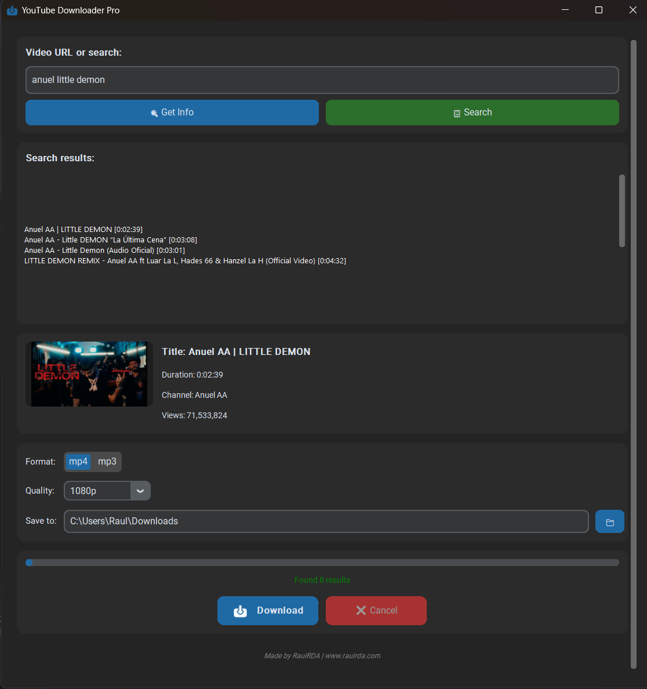

<div align="center">

  

  # YouTube Downloader Pro

  
  
  

  *A clean little app to download YouTube videos as MP4 or just the audio as MP3. Search by name, pick your quality, and you're good to go.*

</div>


## ✨ Features

| Feature | Description |
|---------|-------------|
| 🎥 **MP4 Download** | Save videos in quality up to 4K |
| 🎵 **MP3 Download** | Extract audio only, perfect for music |
| 🔍 **Search** | Find videos by name without leaving the app |
| 📁 **Custom Folder** | Choose where to save your downloads |
| 🖼️ **Video Info** | See title, channel, duration and views before downloading |


## 📸 Screenshot




## 🚀 Installation

### Option 1: Download the executable (Windows)
1. Go to [Releases](https://github.com/RaulRDA/youtube-downloader-pro/releases)
2. Download `YouTubeDownloaderPro.exe`
3. Place `ffmpeg.exe` in the same folder (required for MP3 and high quality videos)
4. Run the app

### Option 2: Run from source
```bash
git clone https://github.com/RaulRDA/YouTubeDownloaderPro.git
cd YouTubeDownloaderPro
pip install -r requirements.txt
python main.py
```


## 📦 Requirements

- **Python 3.8+** (if running from source)
- **ffmpeg** (required for MP3 conversion and video+audio merging)
  - Download from [ffmpeg.org](https://ffmpeg.org/)
  - Place `ffmpeg.exe` in the same folder as the app or add to PATH


## 🎮 How to use

1. **Paste a YouTube URL** or **type a search term**
2. Click **"Get Info"** to see video details
3. Or click **"Search"** and select from results
4. Choose **MP4** (video) or **MP3** (audio)
5. Pick your **quality**
6. Click **Download** and wait

> The progress bar shows you exactly how it's going. You can cancel anytime.


## 📄 License

**MIT License** – You can see, modify and distribute this software, but you must give credit to the original author.
See the full [LICENSE](LICENSE) file for details.


## 👤 Author

**RaulRDA**
- Website: [www.raulrda.com](https://www.raulrda.com)
- GitHub: [@RaulRDA](https://github.com/RaulRDA)


## 🙏 Acknowledgments

- [yt-dlp](https://github.com/yt-dlp/yt-dlp) – The powerhouse behind downloads
- [customtkinter](https://github.com/TomSchimansky/CustomTkinter) – Modern UI made simple
- [FFmpeg](https://ffmpeg.org/) – Audio and video processing


<div align="center">
  <sub>Built with ❤️ and Python</sub>
</div>